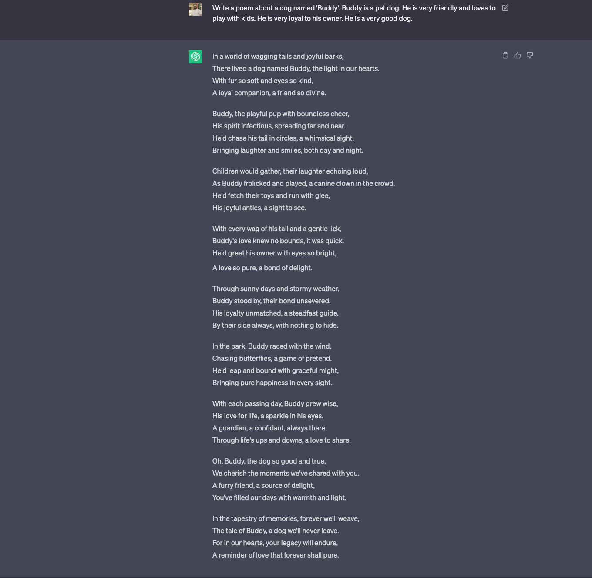
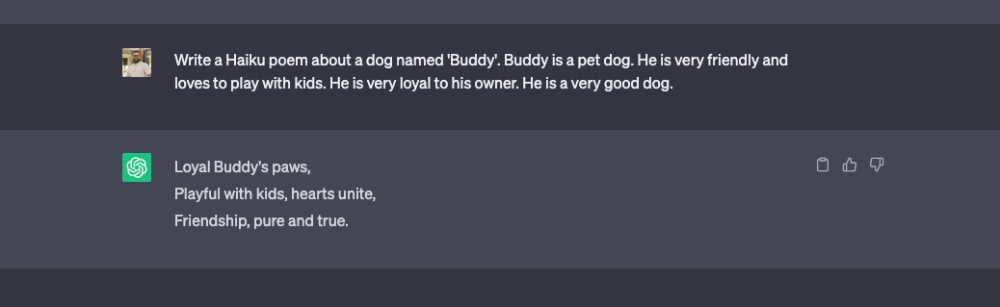

# Prompt Design 101

## What is Prompt?

Think of a prompt as a question or a statement that you give to a model. This is a text that we send to a LLMs(Large Language Models) to get a response. We will cover what LLMs are in the future article in detail.

## Why do we need Prompt Design?

So far you might have seen numerous blogs, tweets and articles on what is the right way to communicate with ChatGPT and other large language models(LLMs). These points are to help you get the most out of the LLMs.

But, you might have noticed that the results are not always great. Sometimes they are good, sometimes they are bad. Sometimes they are funny, sometimes they are not, and best of all sometimes they are completely off the mark. Which peopl in the field call as **"hallucinations"**.

So, how do we get the most out of the LLMs? How do we make sure that the results are good? How do we make sure that the results are not off the mark? That is where right prompts come into play. And Prompt Design is the process of designing the right prompts.

## What is Prompt Design?

### Task / Instructions / Commands
Prompt Design is a process of designing prompts for a given task. It is a process of designing a prompt that will help the model to perform a given **"Task"**. You can also call it instructions or commands.

Think of LLMs as a human for time being. If you ask a human to do a task, you will have to give them a instruction.
For example:  
If you ask a human to write a poem, you will have to give them a instructions like:
  - write a poem about a dog
  - try not to make it sad
  - try to make it funny
  - and so on 

### Persona / Role / Character
But you will not give a task of writing a poem to any human, you might research a bit then try to find peopl who have written poems before and then ask them to write a poem. This is because you know that they have experience in writing poems and they will be able to write a poem. Let's call this experience, expertise or skill as **"Persona"**. You can also call it role, character, etc.

Okay so now you have found a person who has experience in writing poems. Now you will ask him our original task:
`'write a poem about a dog'`. The person might ask for more question or not and based on how much you like or dislike the poem, you will give feedback to the person. The person will take the feedback and will try to improve the poem. This process will continue until you are satisfied with the poem.

Let's see how this process looks when you are interacting with a LLM. Let's take ChatGPT as an example. ChatGPT is a LLM that is trained on large amount of data which vary from books, articles, blogs, tweets, etc. So, it has a lot of knowledge about the world.

Okay not bad at first try, let's try to improve it a bit. 

### Context / Background / Additional Information
Let's try to make it more specific. Say we want to write about a dog that is a pet and dog name is "Buddy". So, we will give the following information to ChatGPT:

> Write a poem about a dog named 'Buddy'. Buddy is a pet dog. He is very friendly and loves to play with kids. He is very loyal to his owner. He is a very good dog.

Now we can see the results are tuned to our dog *Buddy*, it feels more personal now rather than some random dog. 

Giving additional information to the model helps it to generate better results. This is what we call as **"Context"**. You can also call it as additional information, background, etc.

### Output / Results / Response

Okay now we have a poem about our dog *Buddy*. But we let's say we don't want this big of a poem, we want a short poem. Let's say we want to model to write a [Haiku]() poem. So, we will give the following information to ChatGPT:

> Write a Haiku poem about a dog named 'Buddy'. Buddy is a pet dog. He is very friendly and loves to play with kids. He is very loyal to his owner. He is a very good dog.

It's not best but the addition of the sentence `Write a Haiku poem` helped the model to generate a Haiku poem. This is what we call as **"Output formatting"**. You can also call it as results, response, etc.

### Feedback / Rating / Score

Okay now we have a Haiku poem about our dog *Buddy*. But let's say we don't like the poem. So, we will conitue to tweak the instructions until we get the desired results. This is what we call as **"Feedback"**. You can also call it as rating, score, etc.

> We will not cover this part in this article, but encourage you to try it out yourself.

### Summary

So far we covererd building blocks of Prompt Design. Let's summarize them:

1. Task / Instructions / Commands
2. Persona / Role / Character
3. Context / Background / Additional Information
4. Output / Results / Response
5. Feedback / Rating / Score 

## Why is Prompt Design important?

Based on the examples discussed above you can see that when we build our prompts in a certain way, we can get better results. This is what we call as **"Prompt Design"**.

Prompt Design is important because it helps the model to perform better at a given task. It is a process of designing a prompt that will help the model to perform a given task.

## Conclusion

Prompt Design is a process of designing prompts for a given task. It is a process of designing a prompt that will help the model to perform a given **"Task"**. You can also call it instructions or commands.

There are many other things that we can cover in Prompt Design, but we will cover them in the future articles. 

